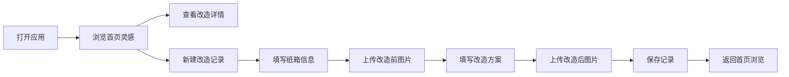

## 1. 产品概述

快递纸箱二次利用创意日志是一款面向环保爱好者和手工创作者的纸箱改造记录工具。用户可以记录每次收到的快递纸箱信息（尺寸、瓦楞层数、完整度），关联自己的改造方案（收纳盒、猫窝、手工材料等），上传改造前后对比图，并按改造类型分类浏览灵感，激发更多创意。

- 目标用户：喜欢废物利用、手工创作的环保人士
- 核心价值：记录纸箱改造历程、积累创意灵感、践行环保生活

## 2. 核心功能

### 2.1 用户角色
| 角色 | 注册方式 | 核心权限 |
|------|----------|----------|
| 普通用户 | 无需注册，本地存储 | 记录纸箱、浏览灵感、管理改造方案 |

### 2.2 功能模块
1. **首页**：统计概览、分类筛选、创意灵感瀑布流
2. **记录页**：纸箱信息录入、改造方案编辑、前后对比图上传
3. **详情页**：改造详情展示、前后对比滑块、步骤说明
4. **分类浏览**：按改造类型（收纳盒/猫窝/手工材料等）筛选查看

### 2.3 页面详情
| 页面名称 | 模块名称 | 功能描述 |
|----------|----------|----------|
| 首页 | 统计卡片 | 展示已改造纸箱数、累计节省纸箱数、改造类型分布 |
| 首页 | 分类标签栏 | 按改造类型快速筛选灵感 |
| 首页 | 灵感卡片瀑布流 | 展示所有改造项目的缩略卡片 |
| 记录页 | 纸箱信息表单 | 录入尺寸、瓦楞层数、完整度、来源快递 |
| 记录页 | 改造方案表单 | 选择类型、填写名称、描述、步骤 |
| 记录页 | 图片上传区 | 上传改造前、改造后对比图片 |
| 详情页 | 前后对比滑块 | 拖动滑块对比改造前后效果 |
| 详情页 | 步骤时间线 | 展示改造步骤说明 |
| 详情页 | 纸箱信息卡 | 展示原始纸箱参数 |

## 3. 核心流程

用户打开应用 → 浏览首页灵感卡片 → 点击查看详情 → 或点击"新建记录" → 填写纸箱信息 → 上传改造前图片 → 填写改造方案 → 上传改造后图片 → 保存记录 → 返回首页查看

## 4. 用户界面设计

### 4.1 设计风格
- **主色调**：温暖牛皮纸棕（#C4956A）、瓦楞纸板灰（#E8E0D5）
- **点缀色**：自然叶绿（#6B8E23）、环保墨绿（#2F4F2F）
- **背景色**：米白卡纸色（#F5F0E8）
- **按钮风格**：圆角矩形，微立体阴影，悬停上浮效果
- **字体**：标题用有手工感的衬线字体，正文用简洁易读的无衬线字体
- **布局风格**：卡片式布局，类似手账/剪贴簿风格，带有轻微的纸张纹理和装订线装饰
- **图标风格**：手绘风格线条图标，带有温暖感

### 4.2 页面设计概述
| 页面名称 | 模块名称 | UI 元素 |
|----------|----------|---------|
| 首页 | 顶部标题区 | 大标题、副标题、新建按钮，背景有瓦楞纸纹理 |
| 首页 | 统计卡片区 | 三张并排数据卡片，带数字动画和小图标 |
| 首页 | 分类标签栏 | 横向滚动标签，选中态为牛皮纸色底 |
| 首页 | 灵感瀑布流 | 两列瀑布流卡片，悬停微放大，带阴影 |
| 记录页 | 表单区域 | 分组表单，牛皮纸色卡片，左侧标签右侧输入 |
| 记录页 | 图片上传区 | 虚线边框上传框，拖拽/点击上传，预览缩略图 |
| 详情页 | 对比滑块 | 左右拖动对比，带分隔线和手柄 |
| 详情页 | 步骤时间线 | 左侧竖线连接圆点，右侧步骤文字 |

### 4.3 响应式
- 桌面端优先设计，适配平板和手机
- 手机端瀑布流改为单列，统计卡片垂直排列
- 触摸优化：增大点击区域，支持手势滑动切换

### 4.4 动效设计
- 页面进入时卡片依次淡入上滑（stagger 动画）
- 悬停卡片轻微上浮 + 阴影加深
- 新建记录按钮有呼吸光效
- 图片加载时骨架屏脉冲动画
- 对比滑块拖动时有平滑过渡
