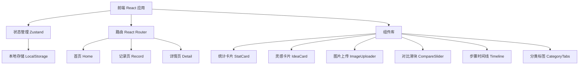
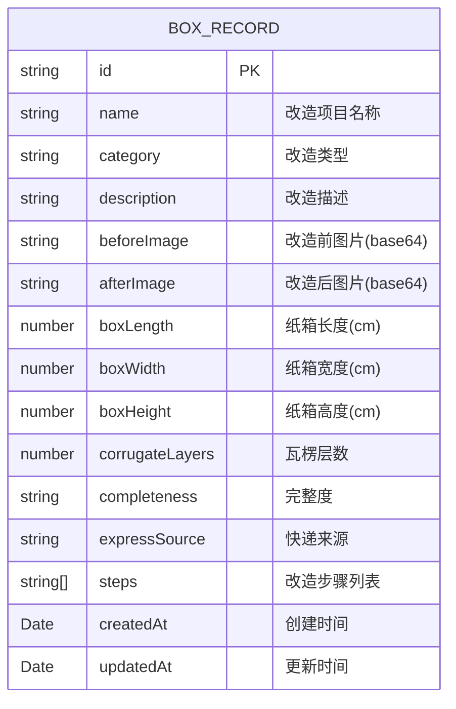

## 1. 架构设计



## 2. 技术描述

- **前端框架**：React 18 + TypeScript
- **构建工具**：Vite
- **样式方案**：TailwindCSS 3
- **路由管理**：react-router-dom
- **状态管理**：zustand
- **数据持久化**：localStorage（纯前端，无需后端）
- **图标库**：lucide-react

## 3. 路由定义

| 路由 | 页面 | 用途 |
|------|------|------|
| `/` | 首页 | 统计概览、分类筛选、灵感瀑布流 |
| `/record` | 记录页 | 新建纸箱改造记录 |
| `/record/:id` | 记录页 | 编辑已有改造记录 |
| `/detail/:id` | 详情页 | 查看改造详情、前后对比 |

## 4. 数据模型

### 4.1 数据结构定义



### 4.2 改造类型枚举
- 收纳盒 storage
- 猫窝 catHouse
- 手工材料 craft
- 玩具 toy
- 花盆/种植 pot
- 展示架 display
- 其他 other

### 4.3 完整度枚举
- perfect "完好无损"
- good "轻微折痕"
- fair "有破损但可用"
- poor "破损较严重"

## 5. 状态管理设计

### 5.1 Store 结构
```typescript
interface BoxStore {
  records: BoxRecord[]
  currentCategory: string
  addRecord: (record: Omit<BoxRecord, 'id' | 'createdAt' | 'updatedAt'>) => void
  updateRecord: (id: string, record: Partial<BoxRecord>) => void
  deleteRecord: (id: string) => void
  getRecordById: (id: string) => BoxRecord | undefined
  setCategory: (category: string) => void
  getFilteredRecords: () => BoxRecord[]
  getStats: () => { total: number; categories: Record<string, number> }
}
```

## 6. 项目结构

```
src/
├── components/          # 可复用组件
│   ├── StatCard.tsx     # 统计卡片
│   ├── IdeaCard.tsx     # 灵感卡片
│   ├── ImageUploader.tsx # 图片上传
│   ├── CompareSlider.tsx # 前后对比滑块
│   ├── Timeline.tsx     # 步骤时间线
│   └── CategoryTabs.tsx # 分类标签
├── pages/               # 页面组件
│   ├── Home.tsx         # 首页
│   ├── Record.tsx       # 记录页
│   └── Detail.tsx       # 详情页
├── store/               # 状态管理
│   └── useBoxStore.ts   # zustand store
├── types/               # 类型定义
│   └── index.ts
├── utils/               # 工具函数
│   ├── storage.ts       # 本地存储
│   └── image.ts         # 图片处理
├── App.tsx              # 根组件
├── main.tsx             # 入口文件
└── index.css            # 全局样式
```
